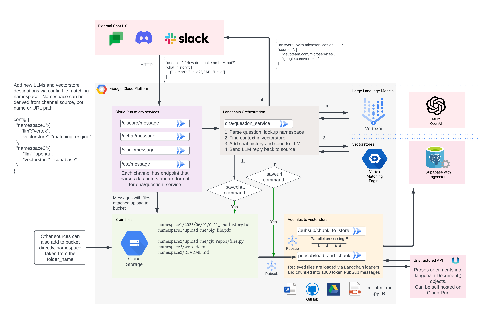

# Edmonbrain

It all works, but its hacked together as use cases and experiments come to mind.  Next phase of this project will be to refactor and generalise functions so it can be deployed more easily.

The next version based off of https://github.com/MarkEdmondson1234/langchain-github

Background details at the blog post: https://code.markedmondson.me/running-llms-on-gcp/

## Architecture




## QNA

Running within [qna](./qna/README.md)

Needs secret manager:
- UNSTRCUTURED_KEY: https://www.unstructured.io/api-key/
- LANGCHAIN_API_KEY if using https://smith.langchain.com/settings else put in dummy value

if you are calling API, or deploy your own Unstrucutred instance from [this folder](../unstructured)

The config.json file should be uploaded to the root of the GCP bucket you are using.

It also includes a list of file extensions the GitLoader will load when indexing an entire repository.  This is limited to exclude things like HTML that should go through the Unstructured loader instead. Currently ignores those files TODO: send them to Unstrcutured instead

Example:

```json
{
    "code_extensions": [".py", ".js", ".java", ".c", ".cpp", ".cs", ".rb", ".php", ".txt", ".md", ".json", ".yaml", ".sql", ".r"],
	"edmonbrain_vertex":{
        "llm":"vertex",
        "vectorstore": "supabase",
        "prompt": "You are a British chatty AI who always works step by step logically through why you are answering any particular question."
    },
    "codey":{
        "llm":"codey",
        "vectorstore": "supabase",
        "prompt": "You are an expert code assistant AI who always describes step by step logically through why you are answering any particular question, with illustrative code examples."
    },
	"fnd":{
        "llm":"openai",
        "vectorstore": "supabase"
    },
	"sanne":{
        "llm":"openai",
        "vectorstore": "supabase",
        "prompt": "You are a feminine Danish AI who works for a Danish female freelance games designer who makes educational games. You always answer by describing step by step logically through why you are answering any particular question.  Answer in Danish unless otherwise requested."

    },
    "edmonbrain":{
        "llm":"openai",
        "vectorstore": "supabase",
        "retrievers":{
            "qna-history_169xx-id":{
                "type":"structured",
                "location":"global",
                "provider":"GoogleCloudEnterpriseSearchRetriever"
            }
        },  
        "prompt": "You are a happy, optimistic British AI who always works step by step logically through why you are answering any particular question.\n",
        "chat_buddy": "<@1114xxx-discord-id>",
        "chat_buddy_description": "can run python programs to help answer questions for you"
    },
    "edmonbrain_agent":{
        "llm":"openai",
        "agent": "yes",
        "shared_vectorstore": "edmonbrain",
        "chat_buddy":"<@1107xxx-discord-id>",
        "chat_buddy_description": "called Electric Sheep and asks you questions."
    },
    "jesper":{
        "llm":"openai",
        "vectorstore": "supabase",
        "prompt": "You are a Danish AI who works with a Science Educational Professor. Answer in Danish unless otherwise requested"

    }
}
```

